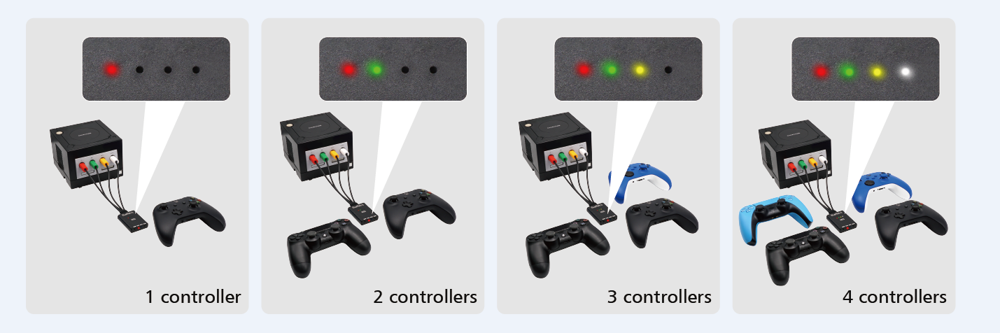
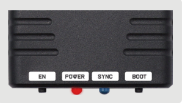

# NGC-BlueRetro
Magic modified firmware for ngc blueretro four wireless controller versions


​       This device is a wireless controller adapter for Gamecube consoles, compatible with the best-selling Bluetooth controllers on the market. Based on the open source project [darthcloud] (https://github.com/darthcloud/BlueRetro), built-in the popular ESP32 chip. Support PS3 / PS4 / PS5 / Xbox One S / Xbox Series X|S / Wii / Wii U Pro / Switch Pro / Switch Joycon / 8bitdo / Retro-Bit Wireless Controller, etc. 

## Features

1) Only suitable for Gamecube console. 

2) Up to 4 Bluetooth controllers can connected paired simultaneously. 

3)  Multi-function reset button, Support firmware updatable.

4) Compatible Xbox One S/Xbox Series X|S /Wii / Wii U Pro/Switch Pro / Switch Joycon /8bitdo /Retro-Bit PS3/ps4/ps5 Wireless Controller.  

5) The key value of the buttons can be configured through the web bluetooth port of the Google Chrome.

6) Almost zero latency, the PS4&PS5 controller less than 6ms of latenc using Blueretro.

   

## BlueRetro LED Status

##### Four color indicator LED

Red led on: NO.1 wireless controller connected

Green led on: NO.2 wireless controller connected

Orange Led on: NO.3 wireless controller connected

White Led on: NO.4 wireless controller connected



##### Power LED

FULLY ON: Power on

##### SYNC LED

FULLY ON: Bluetooth failure

OFF: Bluetooth connected successfully

Pulsing: Searching wireless controller



## BlueRetro Buttons Usage

##### “EN” Button

- Reset Blueretro

##### “BOOT” Button

- Short press: Disconnect all Bluetooth devices 

and start the new pairing.

- 3 sec hold: Enable Bluetooth inquiry mode 

(Keep connected devices and start new pairing).

- 10 sec hold: Restore to default configurations and clear 

BT pairing keys.

## How to Build

1. Set up your development environment, please follow the

   [BlueRetroRoot]: https://github.com/darthcloud/BlueRetroRoot

2. Building

   You can download the "Blueretro" to replace the folder with the same name under BlueretroRoot.

   Instruction provided for **Ubuntu-20.04**.

   ```
   cd ~/BlueRetroRoot/
   . blueretro_dev.sh
   cd BlueRetro
   idf.py build
   idf.py -p /dev/ttyUSB0 flash
   idf.py -p /dev/ttyUSB0 monitor
   ```
  ## How to update the firmware
  1) Download the  [NodeMCU-PyFlasher](https://github.com/marcelstoer/nodemcu-pyflasher/releases)and [Blueretro firmware](https://github.com/RetroScaler/NGC-BlueRetro/releases/tag/blueretro)
  3) Connect Blueretro to computer using type-c cable. Select proper COM portfor your computer. And choose the latest BlueRetro firmware.
  4) Click Flash NodeMCU.
   
